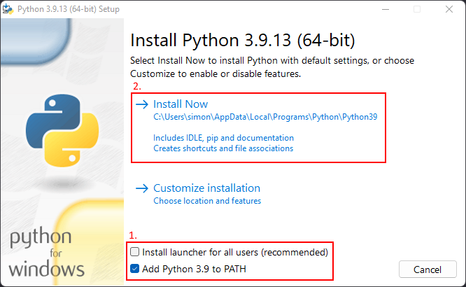

# Artificial Invaders

[Artificial Invaders](https://robotuprising.fi/hackathon/artificial-invaders/) is a story-driven, strategic robotics game designed for hacker teams experienced in Artificial Intelligence and Robotics.

## Challenges

The simulation platform is [``Webots``](https://cyberbotics.com/), which is an open source robotics simulation software. It is available for ``Windows``, ``Linux`` and ``macOS``.

In Webots, you can easily model custom robots and control them by using ``Python``. The code that is written for the simulation can be reused easily with the real physical robot running on for instance Arduino or Rasberry Pi.

For the pre-challenges, we will provide you a premade robot model and the game arena. So, you can focus on the crucial robotic skills, e.g. coding and AI. In other words, there is no need to spend time learning Webots thoroughly (unless you want to!).

- [Playground](playground)
- [Challenge 0](challenge_0)
- [Challenge 1](challenge_1)
- [Challenge 2](challenge_2)
- [Challenge 3](challenge_3)

## Getting started

1. Install [``Python 3.9 64-bit``](https://www.python.org/downloads/release/python-390/) (3.7, 3.8 work too)

_Make sure to set the checkboxes as shown_

2. Install [``Webots``](https://cyberbotics.com/)

3. Download the repository
