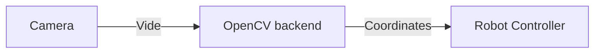

## #2 EYES WIDE OPEN

> Is this the real life? Is this just fantasy?  
> Caught in a landslide, no escape from reality  
> Open your eyes, look up to the skies and seeeeee!

Blind bots won’t help anyone.
The third challenge will prepare teams to know their surroundings through a computer vision task.
Teams need to identify both still and moving objects so that they won't be surprised
by enemy robots or other creatures running in the dark streets of Helsinki, 2043.

### Description

In this challenge, you get to implement computer vision into your bot.
You should start with your own solution to the previous challenge.
However, just like in real life, your bot doesn't just magically know where the target balls are.
Instead, just like during the final weekend battle, there's a camera overlooking the arena.
You'll need to use its video feed to find the targets!

The game logic is also a little bit more complex than last time: there's both green and yellow balls in the arena.
The target is to get all the **green balls into the red goal** and all the **yellow balls into the blue goal**.

#### What's provided

The challenge folder contains a baseline solution that detects colored balls.
The detection is made with OpenCV in a stand-alone python script (run as a separate thread), and the
processed coordinates are sent to the robot over a TCP connection.
This system is created to mimic the real scenario you'll face during the weekend:
we're providing you with the video feed over a network connection, but since the
processing will likely require quite a bit resources, it needs to be run on a more
powerful computer than the one on the robot.

There's a simulated camera implemented into Webots, which will stream the
video to the OpenCV backend.
The processed coordinates are then sent over another TCP connection to the robot.

In addition, there's a jupyter notebook that contains the same OpenCV algorithm:
it is provided simply as a playground to make it easier to tweak the algorithm.

#### What you need to do

Modify the OpenCVClient code to separate the green balls from the yellow ones. The code is in the camera_controller folder.
Add logic to your existing solution so that it separates the balls into the correct goals.

**Note** that there is a small delay at the start of the simulation to ensure the TCP connections are up.

### Getting up and running

If you want to use the Jupyter notebook, the steps below are recommended.
As an alternative, you can just simply run `pip3 install -r requirements.txt`.

#### Virtual environment setup
Navigate to the `challenge_2` directory.

Install `venv` on your computer

    sudo apt install python3-venv

Create a new virtual environment. We'll call it `robot_env`

    python3 -m venv robot_env

Activate our new environment.

    source robot_env/bin/activate

Install the requirements for our project.

    pip install -r requirements.txt

Run webots from within the (robot_env)

    webots

Make our new environment available to Jupyter Lab

    pip install ipykernel
    sudo robot_env/bin/python -m ipykernel install --name robot_kernel

Next time you open Jupyter Lab, you can change the kernel to `robot_env` and 
it will be able to run the notebook with no additional information.

